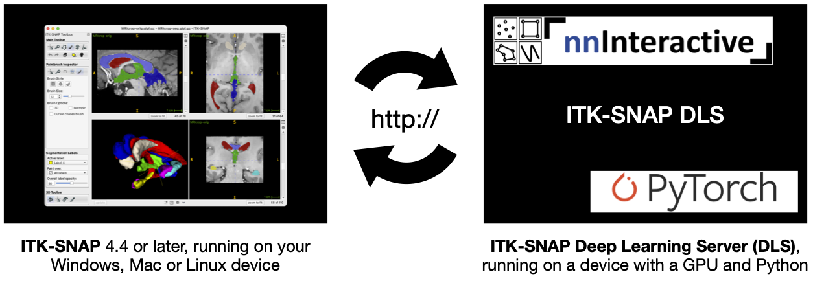
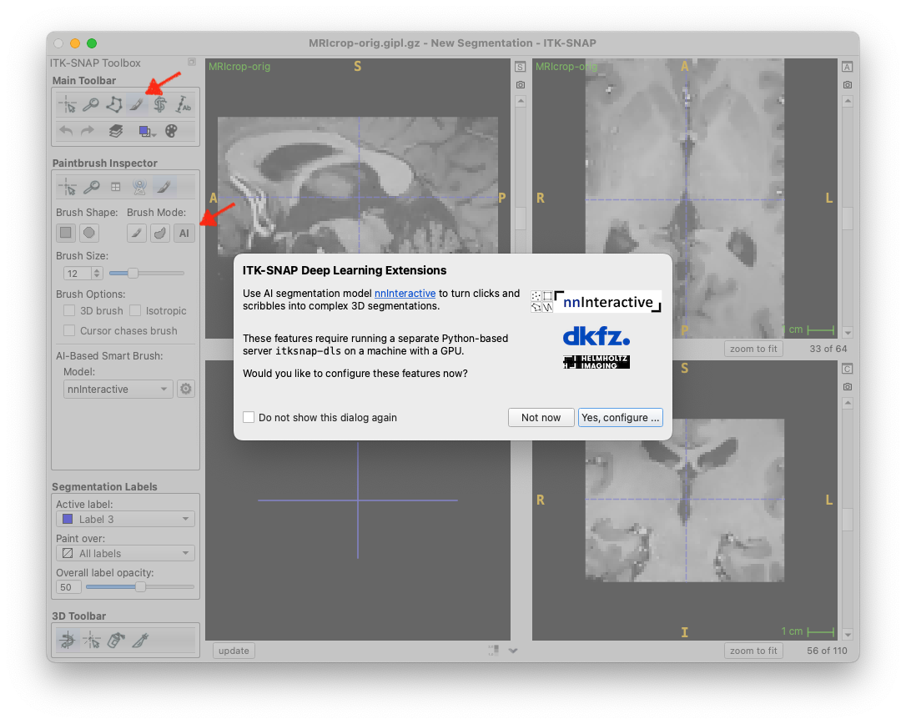
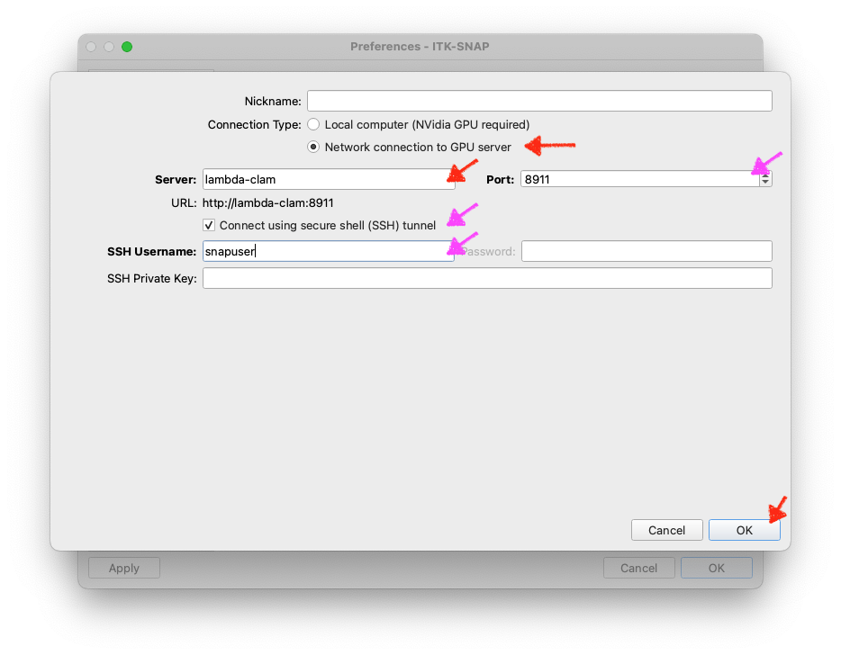
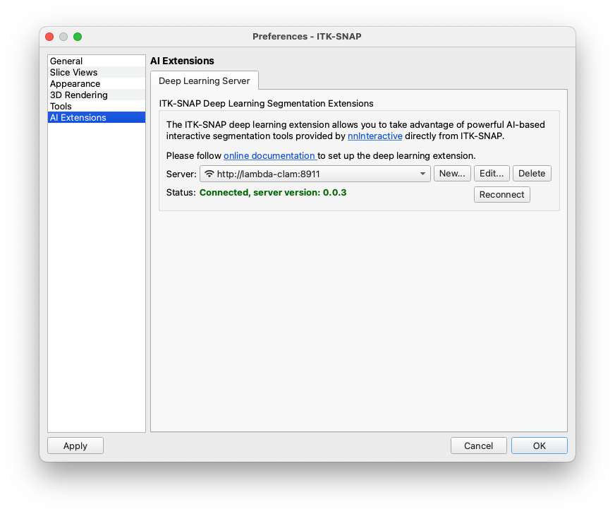
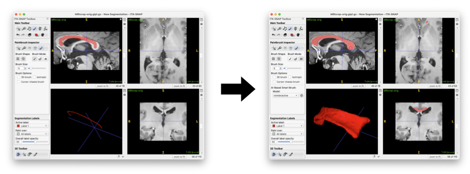
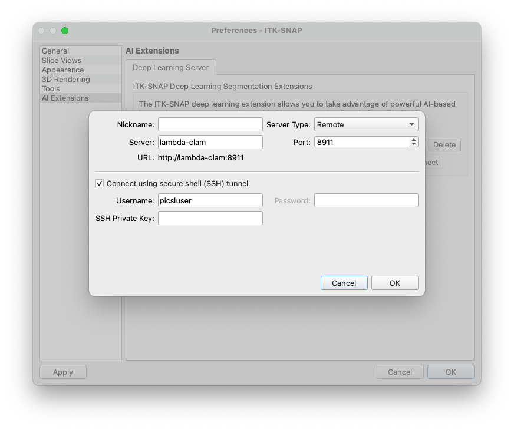

ITK-SNAP DLS Quick Start
========================
ITK-SNAP DLS is in active development. Please bookmark this page and check for updates.

Overview
--------
This extension allows you to take advantage of powerful AI-based interactive segmentation tools provided by [nnInteractive](https://github.com/MIC-DKFZ/nnInteractive) directly from [ITK-SNAP](https://itksnap.org). In seconds, scribbles drawn using the ITK-SNAP paintbrush are transformed into complex 3D segmentations.

*If you use this feature for published work, please cite the most recent **nnInteractive** publication from Isensee et al.* Currently, the suggested citation is:

> Isensee, F.\*, Rokuss, M.\*, Krämer, L.\*, Dinkelacker, S., Ravindran, A., Stritzke, F., Hamm, B., Wald, T., Langenberg, M., Ulrich, C., Deissler, J., Floca, R., & Maier-Hein, K. (2025). nnInteractive: Redefining 3D Promptable Segmentation. https://arxiv.org/abs/2503.08373 \
> *: equal contribution

Link: [](https://arxiv.org/abs/2503.08373)

Requirements
------------
A computer with an NVidia GPU and Python is required. This can be the same computer on which you run ITK-SNAP or another computer on your local network. We will refer to this computer as the "GPU server".




Installation on GPU Server
--------------------------
* Ensure that NVidia CUDA drivers are installed and up to date on the GPU server
* Ensure that Python is available on the GPU server

### 1. Create a virtual environment

This step is not strictly necessary, but creating a virtual environment for the ITK-SNAP DLS server keeps its Python configuration separate. You can use the `conda` virtual environment manager, or other virtual environment tools. Here is the example using `conda`:

```
conda create -n itksnap-dls python=3.12
conda activate itksnap-dls
```

### 2. Install ITK-SNAP DLS

Install ITK-SNAP DLS using `pip`:

```
pip install itksnap-dls
```

Running the ITK-SNAP DLS service
--------------------------------
To run the service with default options, run:

```
python -m itksnap_dls
```

The first time you run this command, [nnInteractive](https://github.com/MIC-DKFZ/nnInteractive) models will be downloaded. After downloading the models, a list of URLs for the ITK-SNAP DLS service will be provided. 

```
$ python -m itksnap_dls 
***************** ITK-SNAP Deep Learning Extensions Server ******************
    Using GPU 0: NVIDIA RTX A6000
    Use one of the following settings in ITK-SNAP to connect to this server:
        Server: 10.150.40.44                              Port: 8911
        Server: lambda-clam                               Port: 8911
        Server: 127.0.1.1                                 Port: 8911  †
        Server: localhost                                 Port: 8911  †
        †: only works if ITK-SNAP is running on the same computer
******************************************************************************
```

Connecting to DLS from ITK-SNAP
--------------------------------

The deep learniing segmentation extension in ITK-SNAP is accessed under the paintbrush tool, when activating the "AI" button. The first time you press this button, the following window will appear:



Pressing "Yes, configure" will open the Preferences Dialog, "AI Extensions" page. Press the **New...** button to open a dialog where you can enter the server address and port, as shown below. If successful, you will see a green "Connected" message under server status.




If you get a red error message instead, please see troubleshooting below.

Using nnInteractive from ITK-SNAP
--------------------------------

* Just draw with the "AI" paintbrush. Your scribbles will be converted by **nnInteractive** to 3D segmentations. You can use the left mouse button to label pixels that should belong to the structure of interest, and right mouse button to label pixels that should be removed from the structure. When you change the active label, the **nnInteractive** interaction state is reset -- as if you are starting a new segmentation. 



* You can also enable "AI mode" for the polygon tool. Your polygons will be sent to **nnInteractive** and treated as lasso interactions.

* ITK-SNAP currently supports three types of **nnInteractive** interactions:
    * **Point interaction:** when you click once using the paintbrush
    * **Scribble interaction:** when you draw using the paintbrush (press, drag, and release) 
    * **Lasso interaction:** when you draw using the polygon tool with AI mode enabled 


Troubleshooting
---------------

### Errors running itksnap-dls on the server

1. Error messages related to SSL certificates (`SSL: CERTIFICATE_VERIFY_FAILED`):

    * Use `-k` option to disable certificate verification: 
    
            python -m itksnap_dls -k

2. `ERROR:    [Errno 13] error while attempting to bind on address ('0.0.0.0', 8891): permission denied`:

    * Use `-p` option to specify a different port number. Check with you system administrator for what ports are available.

                python -m itksnap_dls -p 9233


### ITK-SNAP unable to connect to the server

Errors are likely caused by a firewall on your server. Some options to resolve this are:

* If `itksnap-dls` prints out more than one server/port pairs that can be used, try them all. Server address `127.0.0.1` should be used when ITK-SNAP and `itksnap-dls` are running on the same machine. Other server addresses, like `10.150.40.44` are meant to be used when `itksnap-dls` is running on a remote machine. 

* Ask the system administrator to open the port being used by `itksnap-dls` on the GPU server, e.g., port 8911 or whatever port number you provide using the `-p` option. 

* Use secure shell (SSH) tunneling built into ITK-SNAP. This is a very experimental feature in ITK-SNAP. Check the SSH tunnel button when setting up the server in ITK-SNAP and enter the username you use to login to the GPU server. ITK-SNAP will attempt to open a secure shell connection to the GPU server and to use this connecting to send data to `itksnap-dls`. You may be prompted for your password. ITK-SNAP currently does not store this password, and if we will in the future, it will use your operating system's keychain.



* Use SSH tunneling using an external program. This feature is provided by the command-line program `ssh.exe` (Windows) or `ssh` (MacOS/Linux). Open a terminal window on the computer running ITK-SNAP, and run the command

        ssh username@servername -L 8891:localhost:8891

    For example

        ssh picsluser@lambda-clam -L 8891:localhost:8891

    As long as the SSH session is active, all traffic to your local machine's port 8891 will be forwarded to the server. In ITK-SNAP, you would now use the server `localhost` and port `8891` to connect to the server.


