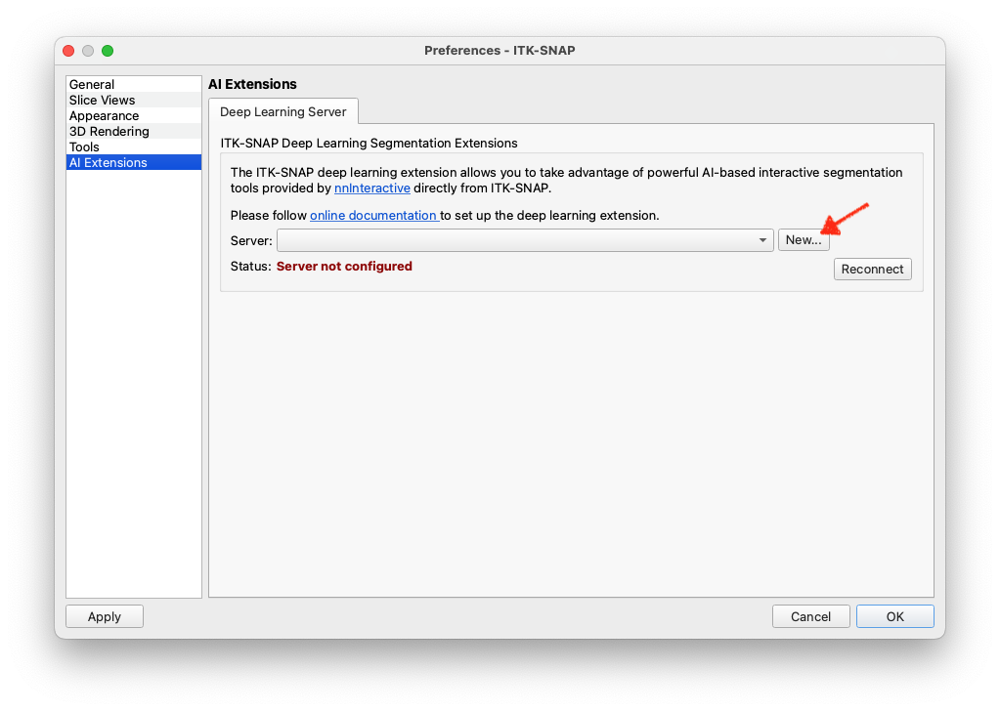
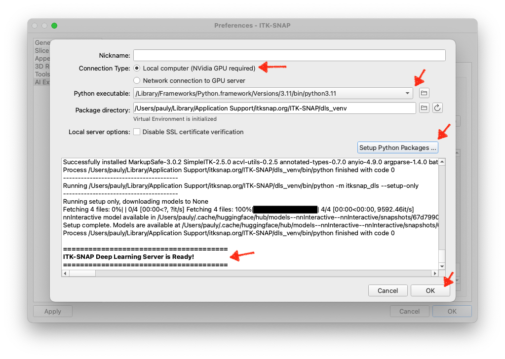
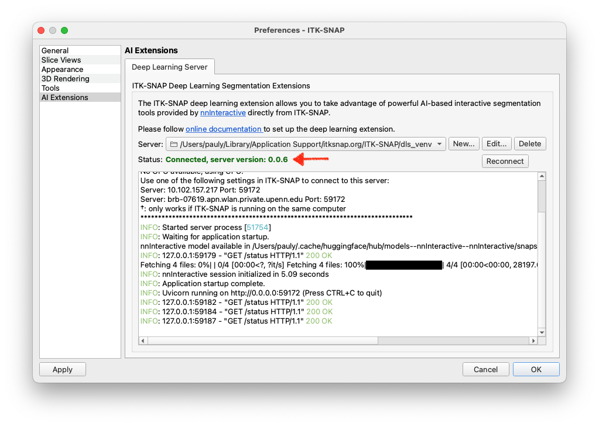

# ITK-SNAP DLS Quick Start
ITK-SNAP DLS is in active development. Please bookmark this page and check for updates.

## Overview
The ITK-SNAP deep learning server (DLS) is a Python-based extension that allows you to take advantage of powerful AI-based interactive segmentation tools provided by [nnInteractive](https://github.com/MIC-DKFZ/nnInteractive) directly from [ITK-SNAP](https://itksnap.org). In seconds, scribbles drawn using the ITK-SNAP paintbrush or outlines drawn using the polygon tool are transformed into complex 3D segmentations.

*If you use this feature for published work, please cite the most recent **nnInteractive** publication from Isensee et al.* Currently, the suggested citation is:

> Isensee, F.\*, Rokuss, M.\*, Krämer, L.\*, Dinkelacker, S., Ravindran, A., Stritzke, F., Hamm, B., Wald, T., Langenberg, M., Ulrich, C., Deissler, J., Floca, R., & Maier-Hein, K. (2025). nnInteractive: Redefining 3D Promptable Segmentation. https://arxiv.org/abs/2503.08373 \
> *: equal contribution

Link: [](https://arxiv.org/abs/2503.08373)

Future releases of ITK-SNAP DLS may include additional AI-based segmentation and registration tools.  

## Requirements
An NVidia GPU is required to run the ITK-SNAP DLS. The instructions below include several use cases, including when you have a GPU on your computer, on another computer on your local network, or when you want to run ITK-SNAP DLS on a cloud-based NVidia GPU (via Google Colab).

There are two modes of operation for ITK-SNAP DLS:

- **Local Mode:**: ITK-SNAP and the deep learning extension run on the same computer, which has an NVidia GPU. 
- **Remote Mode:** ITK-SNAP runs on a computer without an NVidia GPU, but connects to a remote (or cloud-based) server that has an NVidia GPU. The remote server runs the deep learning extension.

In both cases, the deep learning extension runs as a separate Python program (a "service"). ITK-SNAP connects to this service using the network (HTTP protocol) to use the AI-based segmentation tools.


## Using ITK-SNAP DLS in Local Mode
**Note:** Follow these instructions if you are running ITK-SNAP on a computer with an NVidia GPU.

* Ensure that NVidia CUDA drivers are installed and up to date on the computer running ITK-SNAP
* Ensure that Python 3.10 or later is available on the computer running ITK-SNAP

The deep learniing segmentation extension in ITK-SNAP is accessed under the paintbrush tool, when activating the "AI" button. Alternatively, under the polygon tool, check the "AI mode" checkbox. The first time you press this button, you will see the following window:


Pressing "Yes, configure" will open the Preferences Dialog, "AI Extensions" page. Press the **New...** button to open a dialog where you can configure a new local server. You can also access this dialog by pressing the gear icon, or through the "Preferences" menu. 



Select "Local computer" under "Connection type" and select one of the Python executables available on your computer. Under "Package directory", you can select the directory where you want the `itksnap-dls` package to be installed. The default location should work for most users. Press "Setup Python Packages" to install the required Python packages. This will download and install the `itksnap-dls` package and its dependencies.



Once the installation is complete, press "OK" to close the dialog. You will see a new entry in the server list. You should see output from the running server in the console window, and in a few seconds, the status should change to "Connected".



If you get a red error message instead, please see troubleshooting below.

You are now ready to use nnInteractive from ITK-SNAP. Please see the section below for instructions on how to use nnInteractive from ITK-SNAP.

## Using ITK-SNAP DLS in Remote Mode

**Note:** Follow these instructions if you are running ITK-SNAP on a computer without an NVidia GPU, but can access a NVidia GPU server on your local network or in the cloud. 

### Using ITK-SNAP DLS in Remote Mode on Google Colab

Follow the instructions in this [this Google Colab notebook](https://colab.research.google.com/drive/1AtB2yZgB6KUHb6e0LHVVE9pjsaLANVr5?usp=sharing). In the output of the server, you should see the following banner:

```
***************** ITK-SNAP Deep Learning Extensions Server ******************
    Using GPU 0: Tesla T4
    Use one of the following settings in ITK-SNAP to connect to this server:
        Server: e352-34-91-118-53.ngrok-free.app  Port: 443
******************************************************************************
```

Copy the server address and port number, and then skip ahead to the [Launching the ITK-SNAP DLS service](#Launching-the-ITK-SNAP-DLS-service).

### Using ITK-SNAP DLS in Remote Mode a GPU server on your Local Network
* Login to the GPU server using SSH or other remote access method. 
* Ensure that NVidia CUDA drivers are installed and up to date on the GPU server
* Ensure that Python is available on the GPU server

#### Step 1. Create a virtual environment

This step is not strictly necessary, but creating a virtual environment for the ITK-SNAP DLS server keeps its Python configuration separate. You can use the `conda` virtual environment manager, or other virtual environment tools. Here is the example using `conda`:

```
conda create -n itksnap-dls python=3.12
conda activate itksnap-dls
```

#### Step 2. Install the `itksnap-dls` Python Package

Install ITK-SNAP DLS using `pip`:

```
pip install itksnap-dls
```

### Launching the ITK-SNAP DLS service

To run the service with default options, run:

```
python -m itksnap_dls
```

The first time you run this command, [nnInteractive](https://github.com/MIC-DKFZ/nnInteractive) models will be downloaded. After downloading the models, a list of URLs for the ITK-SNAP DLS service will be provided. 

```
$ python -m itksnap_dls 
***************** ITK-SNAP Deep Learning Extensions Server ******************
    Using GPU 0: NVIDIA RTX A6000
    Use one of the following settings in ITK-SNAP to connect to this server:
        Server: 10.150.40.44                              Port: 8911
        Server: lambda-clam                               Port: 8911
        Server: 127.0.1.1                                 Port: 8911  †
        Server: localhost                                 Port: 8911  †
        †: only works if ITK-SNAP is running on the same computer
******************************************************************************
```

### Connecting to DLS from ITK-SNAP

The deep learniing segmentation extension in ITK-SNAP is accessed under the paintbrush tool, when activating the "AI" button. Alternatively, under the polygon tool, check the "AI mode" checkbox. The first time you press this button, you will see the following window:


Pressing "Yes, configure" will open the Preferences Dialog, "AI Extensions" page. Press the **New...** button to open a dialog where you can configure a new local server. You can also access this dialog by pressing the gear icon, or through the "Preferences" menu. 


Select "Network connection to GPU server" under "Connection type". Enter the server address and port number provided by the `itksnap-dls` service. If running `itksnap-dls` in Google Colab, the port number will be `443`. If running on a local GPU server, the default port is `8911`, but you can change it using the `-p` option when running `itksnap-dls`.


You also have the option to enable secure shell (SSH) tunneling, which is an experimental feature in ITK-SNAP. This is a workaround if the firewall on your remote GPU machine does not allow access to ports like 8911. It is also recommended as a more secure option if you are connecting to the remote GPU machine over the open Internet. 

If you check the "Use SSH tunnel" box, you will be prompted to enter your username for the GPU server. ITK-SNAP will attempt to open a secure shell connection to the GPU server and use this connection to send data to `itksnap-dls`. You may be prompted for your password. ITK-SNAP currently does not store this password, and if we will in the future, it will use your operating system's keychain. 

Press "OK" to close the dialog. You will see a new entry in the server list. If your server is running, in a few seconds, the status should change to "Connected".


If you get a red error message instead, please see troubleshooting below.

## Using nnInteractive from ITK-SNAP

* Just draw with the "AI" paintbrush. Your scribbles will be converted by **nnInteractive** to 3D segmentations. You can use the left mouse button to label pixels that should belong to the structure of interest, and right mouse button to label pixels that should be removed from the structure. When you change the active label, the **nnInteractive** interaction state is reset -- as if you are starting a new segmentation. 


* You can also enable "AI mode" for the polygon tool. Your polygons will be sent to **nnInteractive** and treated as lasso interactions.

* ITK-SNAP currently supports three types of **nnInteractive** interactions:
    * **Point interaction:** when you click once using the paintbrush
    * **Scribble interaction:** when you draw using the paintbrush (press, drag, and release) 
    * **Lasso interaction:** when you draw using the polygon tool with AI mode enabled 


## Troubleshooting

### Errors running itksnap-dls locally or on the remote server

1. Error messages related to SSL certificates (`SSL: CERTIFICATE_VERIFY_FAILED`):

    * If running locally, check the "Disable SSL certificate verification" box. This will disable SSL certificate verification and allow you to run the server without a valid SSL certificate.

    * If running remotely, use `-k` option to disable certificate verification: 
    
            python -m itksnap_dls -k

2. `ERROR:    [Errno 13] error while attempting to bind on address ('0.0.0.0', 8891): permission denied`:

    * Use `-p` option to specify a different port number. Check with you system administrator for what ports are available.

                python -m itksnap_dls -p 9233


### ITK-SNAP unable to connect to the server

Errors are likely caused by a firewall on your server. Some options to resolve this are:

* If `itksnap-dls` prints out more than one server/port pairs that can be used, try them all. Server address `127.0.0.1` should be used when ITK-SNAP and `itksnap-dls` are running on the same machine. Other server addresses, like `10.150.40.44` are meant to be used when `itksnap-dls` is running on a remote machine. 

* Ask the system administrator to open the port being used by `itksnap-dls` on the GPU server, e.g., port 8911 or whatever port number you provide using the `-p` option. 

* Use secure shell (SSH) tunneling built into ITK-SNAP. This is a very experimental feature in ITK-SNAP. Check the SSH tunnel button when setting up the server in ITK-SNAP and enter the username you use to login to the GPU server. ITK-SNAP will attempt to open a secure shell connection to the GPU server and to use this connecting to send data to `itksnap-dls`. You may be prompted for your password. ITK-SNAP currently does not store this password, and if we will in the future, it will use your operating system's keychain.

* Use SSH tunneling using an external program. This feature is provided by the command-line program `ssh.exe` (Windows) or `ssh` (MacOS/Linux). Open a terminal window on the computer running ITK-SNAP, and run the command

        ssh username@servername -L 8891:localhost:8891

    For example

        ssh picsluser@lambda-clam -L 8891:localhost:8891

    As long as the SSH session is active, all traffic to your local machine's port 8891 will be forwarded to the server. In ITK-SNAP, you would now use the server `localhost` and port `8891` to connect to the server.


